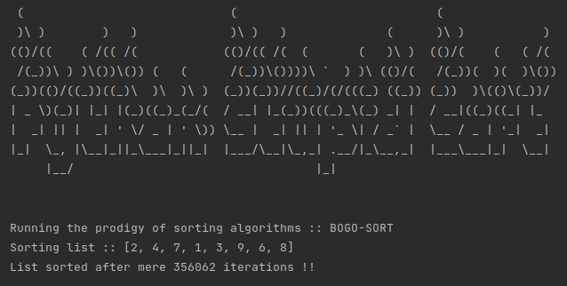

## INTRODUCTION

This is a python3 script that sorts a list of numbers using the efficient BOGO-SORT algorithm.

Bogo-sort (also falsely termed as stupid-sort) is a high-risk, high-reward algorithm that can sort a list in either O(1) or 'god-knows-when' time.

---

## RUNNING THE SCRIPT

Use the good old way:

`python main.py`

---

## EXAMPLES

> Test 01 with list [2, 4, 7, 1, 3, 9, 6, 8]

---

